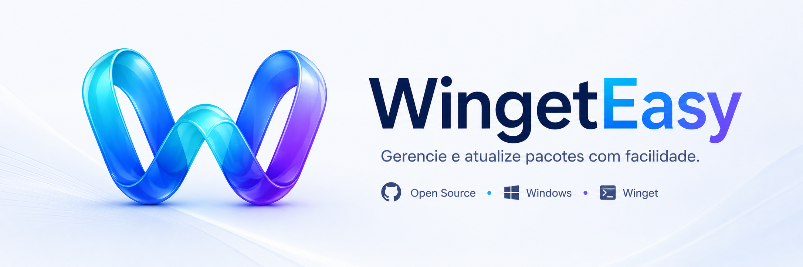

<div align="center">
  

# WingetEasy

**Gerenciador visual para Winget em WinUI 3**

[](https://github.com/WingetEasy/WingetEasy/actions/workflows/ci.yml)
[](LICENSE)

O WingetEasy é um projeto open source para criar uma interface gráfica em cima do Winget, o gerenciador de pacotes nativo do Windows.

[Contribuindo](CONTRIBUTING.md) • [Issues iniciais](Documents/2.%20InitialIssues/LABELS.md) • [Discussions](https://github.com/WingetEasy/WingetEasy/discussions) • [Licença](LICENSE)

</div>

---

## Sumário

- [Visão Geral](#visão-geral)
- [Por Que WingetEasy](#por-que-wingeteasy)
- [Funcionalidades](#funcionalidades)
- [Estado Atual](#estado-atual)
- [Estrutura Do Repositório](#estrutura-do-repositório)
- [Requisitos](#requisitos)
- [Como Executar](#como-executar)
- [Pacotes E Stack](#pacotes-e-stack)
- [Documentação Do Projeto](#documentação-do-projeto)
- [Status Do Roadmap](#status-do-roadmap)
- [Como Contribuir](#como-contribuir)
- [Contribuidores](#contribuidores)
- [Licença](#licença)

## Visão Geral

WingetEasy é um projeto .NET 10 para Windows com WinUI 3, organizado em três projetos principais:

- `WingetEasy.App` para a interface desktop.
- `WingetEasy.Core` para regras de negócio e contratos.
- `WingetEasy.Data` para persistência e acesso a dados.

O objetivo do projeto é entregar uma experiência visual leve em cima do Winget, com o usuário sempre no controle de quando atualizar.

## Por Que WingetEasy

Já existem interfaces maduras para o Winget, como o UniGetUI. O WingetEasy não compete em quantidade de features — o objetivo é ser **a interface mais discreta possível**:

- Consumo mínimo de RAM, mesmo rodando em segundo plano.
- Silêncio por padrão: nada de notificações ou popups além do estritamente necessário.
- O usuário decide sempre quando (ou se) quer instalar uma atualização — nunca há instalação automática sem consentimento explícito.
- A meta é ser o tipo de app que as pessoas esquecem que está rodando, porque simplesmente funciona.

| Critério | WingetEasy | UniGetUI |
| --- | --- | --- |
| Filosofia | Atualizador discreto, minimalista | Gerenciador completo de pacotes |
| Consumo de RAM | Prioridade máxima de design | Não é o foco principal |
| Notificações | Mínimas, só quando necessário | Mais presentes na experiência |
| Instalação de updates | Sempre com consentimento explícito | Suporta automação mais ampla |
| Escopo de features | Intencionalmente reduzido | Amplo (múltiplos gerenciadores, extensões) |

## Funcionalidades

- **Atualizações** — veja de uma vez quais pacotes instalados via Winget têm uma versão nova disponível.
- **Histórico** — acompanhe o que já foi atualizado e quando.
- **Backup** — gere snapshots antes de atualizar, para reverter se algo der errado.
- **Profiles** — agrupe pacotes e preferências para aplicar de forma consistente.
- **Bandeja do sistema** — o app fica disponível na tray, fora do caminho até você precisar dele.
- **Configurações** — controle agendamento de verificações e comportamento de notificações.

## Estado Atual

O que já existe no repositório hoje:

- Solução com os projetos `App`, `Core`, `Data` e o projeto de testes `WingetEasy.Core.Tests`.
- Configuração centralizada de compilação em `Directory.Build.props` e de versões de pacotes em `Directory.Packages.props`.
- Janela principal WinUI 3 com `MicaBackdrop`, `NavigationView` e páginas para Atualizações, Histórico, Backup, Profiles e Configurações.
- Integração com a bandeja do sistema (system tray) via `H.NotifyIcon`, com menu de contexto e comportamentos próprios.
- `WingetService` para comunicação com o Winget CLI, `UpdateService` e `SchedulerService` para checagem e agendamento de atualizações.
- Notificações via `ToastNotificationService` e elevação administrativa via `AdminElevationHelper`.
- Persistência real com EF Core e SQLite: `AppDbContext`, entidades e repositórios para pacotes, profiles, histórico de atualização e logs de checagem, com migrations já aplicadas.
- Projeto de testes com xUnit, FluentAssertions, Moq, cobrindo repositórios, migrations e parsing do Winget.
- Documento de contribuição com convenções de código e fluxo de PR.

O que ainda não está implementado no código atual:

- Fluxo de instalação ou publicação MSIX finalizado.
- Internacionalização completa de strings de UI (resources).

## Estrutura Do Repositório

```text
WingetEasy/
├── src/
│   ├── WingetEasy.App/      UI WinUI 3 (Pages, ViewModels, Services, tray)
│   ├── WingetEasy.Core/     Regras de negócio, contratos e modelos
│   └── WingetEasy.Data/     EF Core, entidades, repositórios e migrations
├── tests/
│   └── WingetEasy.Core.Tests/
├── CONTRIBUTING.md
└── README.MD
```

## Requisitos

Para compilar e executar a solução localmente:

- Windows 10 19041+ ou Windows 11.
- Visual Studio 2022 com os workloads:
    - Desenvolvimento de área de trabalho com .NET.
    - Desenvolvimento de SDK de Aplicativos do Windows.
- Git e .NET 10 SDK.

## Como Executar

1. Abra `WingetEasy.slnx` no Visual Studio.
2. Aguarde o restore dos pacotes NuGet.
3. Defina `WingetEasy.App` como projeto de inicialização.
4. Pressione F5.

Se tudo estiver correto, a janela principal abre com fundo Mica, navegação lateral entre Atualizações/Histórico/Backup/Profiles/Configurações e ícone na bandeja do sistema.

## Pacotes E Stack

- WinUI 3 e Windows App SDK na interface.
- `H.NotifyIcon.WinUI` para a integração com a bandeja do sistema.
- Serilog para logging.
- Entity Framework Core e SQLite para persistência.
- `System.CommandLine` e `Microsoft.Extensions.DependencyInjection`.
- xUnit, Moq e FluentAssertions para testes.

## Documentação Do Projeto

- Veja [CONTRIBUTING.md](CONTRIBUTING.md) para configurar o ambiente e entender as convenções do projeto.
- Veja [pull_request_template.md](pull_request_template.md) para o formato esperado de PR.

## Status Do Roadmap

O backlog inicial está dividido por áreas:

- ✅ Setup da solution e dependências.
- ✅ Core: modelos, contratos e integração com Winget.
- ✅ Data: persistência, repositórios e migrations.
- ✅ UI: interface WinUI, tray, notificações e navegação.
- ⬜ Distribuição: empacotamento, release e documentação.

As issues de maior clareza para começar estão marcadas como `good first issue` no documento de labels.

## Como Contribuir

### Preparando o ambiente

1. Instale o Visual Studio 2022 (17.8+) com os workloads "Desenvolvimento de área de trabalho com .NET" e "Desenvolvimento de SDK de Aplicativos do Windows".
2. Garanta Windows 10 21H1+ (ou 11) e o .NET 10 SDK instalado.
3. Faça um fork do repositório e clone o seu fork:

   ```bash
   git clone https://github.com/SEU-USUARIO/WingetEasy.git
   cd WingetEasy
   ```

4. Abra `WingetEasy.slnx` no Visual Studio e aguarde o restore dos pacotes NuGet.
5. Defina `WingetEasy.App` como projeto de inicialização e pressione F5. Se o app abrir com a janela Mica e o ícone aparecer na bandeja do sistema, o ambiente está correto.
6. Rode os testes para confirmar que tudo está funcionando: `dotnet test`.

Para o passo a passo completo (estrutura do projeto, convenções de código, fluxo de PR e o que bloqueia um merge), veja [CONTRIBUTING.md](CONTRIBUTING.md).

### Fluxo de contribuição

1. Escolha uma issue com escopo claro — issues marcadas como `good first issue` são as mais indicadas para começar.
2. Comente na issue avisando que vai trabalhar nela.
3. Crie uma branch seguindo a convenção descrita em CONTRIBUTING.md (ex: `feature/issue-6-check-updates-async`).
4. Siga as convenções de código e commit descritas na documentação.
5. Execute `dotnet test` antes de abrir o PR e referencie a issue com `Closes #N`.

Ao contribuir, você concorda em seguir nosso [Código de Conduta](CODE_OF_CONDUCT.md).

## Contribuidores

[](https://github.com/WingetEasy/WingetEasy/graphs/contributors)

Obrigado a todas as pessoas que já contribuíram com código, issues e discussões para o WingetEasy. Quer aparecer aqui? Veja [Como Contribuir](#como-contribuir).

## Licença

Este projeto está licenciado sob a [LICENSE](LICENSE).
