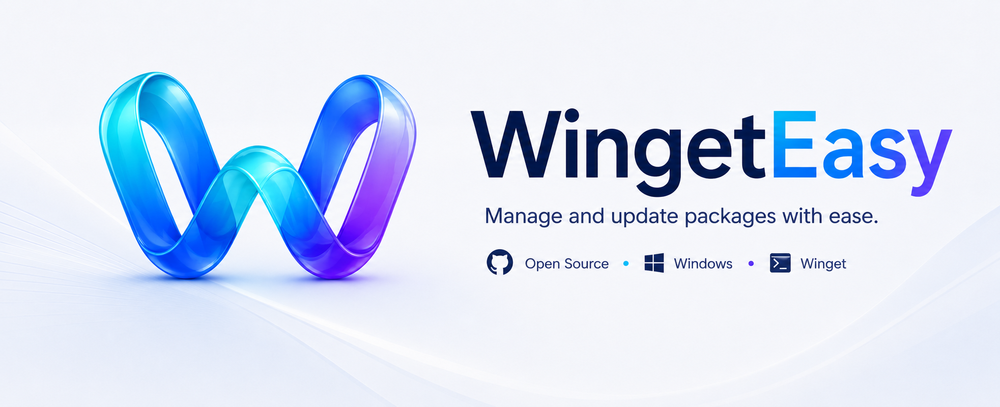

<div align="center">
  

# WingetEasy

**A visual interface for Winget, built with WinUI 3**

[](https://github.com/WingetEasy/WingetEasy/actions/workflows/ci.yml)
[](LICENSE)

WingetEasy is an open source project that brings a graphical interface to Winget, the native Windows package manager.

[Contributing](CONTRIBUTING.md) • [Initial issues](Documents/2.%20InitialIssues/LABELS.md) • [Discussions](https://github.com/WingetEasy/WingetEasy/discussions) • [License](LICENSE)

**🌍 Read this in other languages:** [Português (BR)](README.pt-BR.MD)

</div>

---

## Table of Contents

- [Overview](#overview)
- [Why WingetEasy](#why-wingeteasy)
- [Features](#features)
- [Current State](#current-state)
- [Repository Structure](#repository-structure)
- [Requirements](#requirements)
- [Getting Started](#getting-started)
- [Packages and Stack](#packages-and-stack)
- [Project Documentation](#project-documentation)
- [Roadmap Status](#roadmap-status)
- [How to Contribute](#how-to-contribute)
- [Contributors](#contributors)
- [License](#license)

## Overview

WingetEasy is a .NET 10 project for Windows built with WinUI 3, organized into three main projects:

- `WingetEasy.App` for the desktop interface.
- `WingetEasy.Core` for business rules and contracts.
- `WingetEasy.Data` for persistence and data access.

The goal of the project is to deliver a lightweight visual experience on top of Winget, keeping the user always in control of when to update.

## Why WingetEasy

Mature interfaces for Winget already exist, such as UniGetUI. WingetEasy doesn't compete on feature count — the goal is to be **the most unobtrusive interface possible**:

- Minimal RAM usage, even while running in the background.
- Quiet by default: no notifications or popups beyond what is strictly necessary.
- The user always decides when (or whether) to install an update — there is never an automatic install without explicit consent.
- The goal is to be the kind of app people forget is running, because it simply works.

| Criteria | WingetEasy | UniGetUI |
| --- | --- | --- |
| Philosophy | Discreet, minimalist updater | Full-featured package manager |
| RAM usage | Top design priority | Not the main focus |
| Notifications | Minimal, only when needed | More present in the experience |
| Update installation | Always with explicit consent | Supports broader automation |
| Feature scope | Intentionally narrow | Broad (multiple managers, extensions) |

## Features

- **Updates** — see at a glance which packages installed via Winget have a new version available.
- **History** — track what has been updated and when.
- **Backup** — create snapshots before updating, so you can roll back if something goes wrong.
- **Profiles** — group packages and preferences to apply them consistently.
- **System tray** — the app stays available in the tray, out of your way until you need it.
- **Settings** — control check scheduling and notification behavior.

## Current State

What already exists in the repository today:

- Solution with the `App`, `Core`, `Data` projects and the `WingetEasy.Core.Tests` test project.
- Centralized build configuration in `Directory.Build.props` and centralized package versions in `Directory.Packages.props`.
- Main WinUI 3 window with `MicaBackdrop`, `NavigationView` and pages for Updates, History, Backup, Profiles and Settings.
- System tray integration via `H.NotifyIcon`, with a context menu and custom behaviors.
- `WingetService` for communication with the Winget CLI, plus `UpdateService` and `SchedulerService` for checking and scheduling updates.
- Notifications via `ToastNotificationService` and administrative elevation via `AdminElevationHelper`.
- Real persistence with EF Core and SQLite: `AppDbContext`, entities and repositories for packages, profiles, update history and check logs, with migrations already applied.
- Test project with xUnit, FluentAssertions and Moq, covering repositories, migrations and Winget parsing.
- Contribution guide with code conventions and PR flow.

What is not implemented in the current code yet:

- Finalized MSIX install/publish flow.
- Full internationalization of UI strings (resources).

## Repository Structure

```text
WingetEasy/
├── src/
│   ├── WingetEasy.App/      WinUI 3 UI (Pages, ViewModels, Services, tray)
│   ├── WingetEasy.Core/     Business rules, contracts and models
│   └── WingetEasy.Data/     EF Core, entities, repositories and migrations
├── tests/
│   └── WingetEasy.Core.Tests/
├── CONTRIBUTING.md
└── README.md
```

## Requirements

To build and run the solution locally:

- Windows 10 19041+ or Windows 11.
- Visual Studio 2022 with the workloads:
    - .NET Desktop Development.
    - Windows App SDK Development.
- Git and the .NET 10 SDK.

## Getting Started

1. Open `WingetEasy.slnx` in Visual Studio.
2. Wait for the NuGet package restore to finish.
3. Set `WingetEasy.App` as the startup project.
4. Press F5.

If everything is correct, the main window opens with a Mica backdrop, side navigation between Updates/History/Backup/Profiles/Settings, and an icon in the system tray.

## Packages and Stack

- WinUI 3 and Windows App SDK for the interface.
- `H.NotifyIcon.WinUI` for system tray integration.
- Serilog for logging.
- Entity Framework Core and SQLite for persistence.
- `System.CommandLine` and `Microsoft.Extensions.DependencyInjection`.
- xUnit, Moq and FluentAssertions for testing.

## Project Documentation

- See [CONTRIBUTING.md](CONTRIBUTING.md) to set up the environment and understand the project conventions.
- See [pull_request_template.md](pull_request_template.md) for the expected PR format.

## Roadmap Status

The initial backlog is divided by area:

- ✅ Solution and dependency setup.
- ✅ Core: models, contracts and Winget integration.
- ✅ Data: persistence, repositories and migrations.
- ✅ UI: WinUI interface, tray, notifications and navigation.
- ⬜ Distribution: packaging, release and documentation.

The issues that are clearest to start with are marked as `good first issue` in the labels document.

## How to Contribute

### Setting up the environment

1. Install Visual Studio 2022 (17.8+) with the "​.NET Desktop Development" and "Windows App SDK Development" workloads.
2. Make sure you have Windows 10 21H1+ (or 11) and the .NET 10 SDK installed.
3. Fork the repository and clone your fork:

   ```bash
   git clone https://github.com/YOUR-USERNAME/WingetEasy.git
   cd WingetEasy
   ```

4. Open `WingetEasy.slnx` in Visual Studio and wait for the NuGet package restore.
5. Set `WingetEasy.App` as the startup project and press F5. If the app opens with the Mica window and the icon appears in the system tray, the environment is correct.
6. Run the tests to confirm everything works: `dotnet test`.

For the full walkthrough (project structure, code conventions, PR flow and what blocks a merge), see [CONTRIBUTING.md](CONTRIBUTING.md).

### Contribution flow

1. Pick an issue with a clear scope — issues marked `good first issue` are the best place to start.
2. Comment on the issue to let others know you're working on it.
3. Create a branch following the convention described in CONTRIBUTING.md (e.g. `feature/issue-6-check-updates-async`).
4. Follow the code and commit conventions described in the documentation.
5. Run `dotnet test` before opening the PR and reference the issue with `Closes #N`.

By contributing, you agree to follow our [Code of Conduct](CODE_OF_CONDUCT.md).

## Contributors

[](https://github.com/WingetEasy/WingetEasy/graphs/contributors)

Thanks to everyone who has contributed code, issues and discussions to WingetEasy. Want to appear here? See [How to Contribute](#how-to-contribute).

## License

This project is licensed under the [LICENSE](LICENSE).
